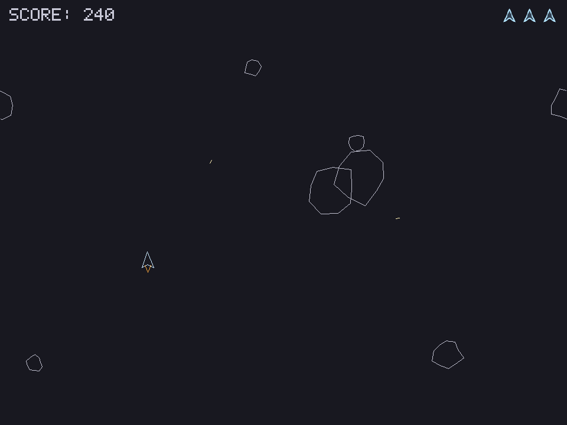
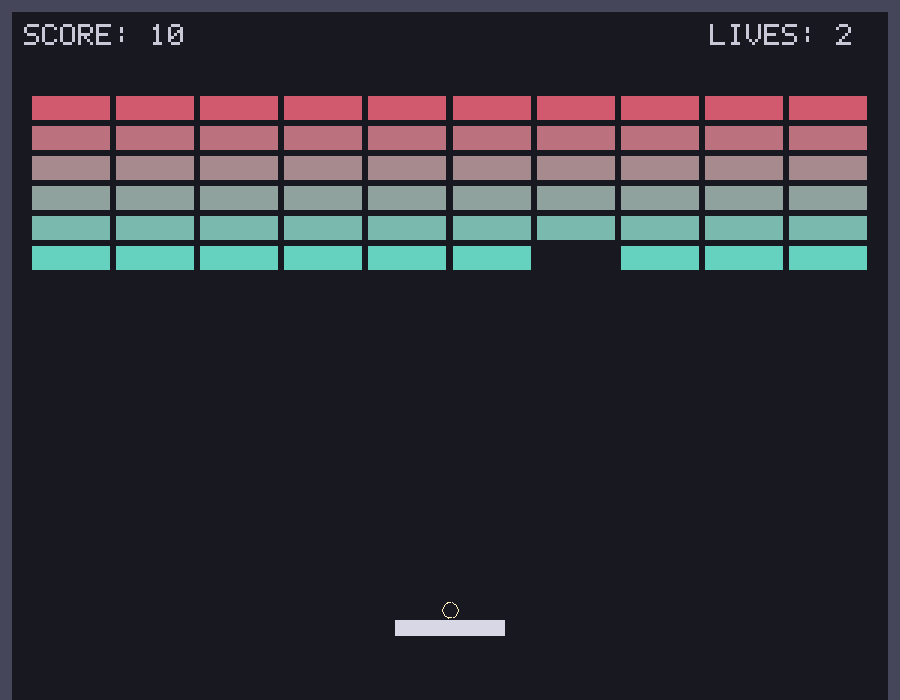

# Tiny Engine

[](https://github.com/artorias961/cplusplus-game-engine/actions/workflows/ci.yml)

| Asteroids | Breakout |
| --- | --- |
|  |  |

Both are running on the same engine. Asteroids draws itself with vector
polygons that rotate and wrap across the screen edges; Breakout is filled
rectangles with a ball that bounces off contact normals. Neither knows anything
about the other, and the engine knows nothing about either.

A minimal 2D game engine in C++17 + SDL2, built to be read end to end in one
sitting, one file at a time. It's the smallest version of the architecture
real engines use: a game loop, an Entity-Component-System, a layered renderer
with a camera, textures, rotation, vector shapes and bitmap text, input
handling, box and circle collision with contact normals, procedural audio,
fixed-tick timing and a scene stack — each in its own file with heavy comments
explaining *why*, not just *what*.

Four games are built on it: **Asteroids**, **Breakout** and **Lane Battle** in
`src/game/`, plus **Snake**, kept as a frozen snapshot in `archive/version_1/`.
That's on purpose — an engine with only one game is a hypothesis, not an engine
— and each needed something the last one didn't: Snake wanted fixed ticks and
box collision, Asteroids wanted rotation and circles, Breakout wanted contact
normals and sub-frame movement. Lane Battle has asked for very little across
eight slices, which is its own kind of result: a battlefield wider than its
window made world and screen coordinates differ for the first time, moving that
rule out of the renderer into `View.h` where a test can reach it; a clickable
spawn bar wanted a mouse; scenery at a distance wanted a parallax factor,
because `screenSpace` was a boolean with nothing between the world and the
screen; and a roster worth rebalancing wanted a way to read a text file, which
the engine had never had. Half its slices have needed nothing at all.

It is **not** trying to be fast, complete, or production-ready. Storage uses
`std::unordered_map` instead of packed arrays, there's no batching, no scene
graph, collision compares every pair, and the asset handling is one cache that
loads PNGs. Those are deliberate: every one of them is a place where the simple
version is easier to read and nothing here is slow enough to care.

## Status

**v1.0 is finished** — complete, not abandoned — and frozen in
`archive/version2/`. It set out to be the smallest readable version of the
architecture real engines use, and every part of that architecture is present
and exercised by independent games, building and testing on Windows, Linux and
macOS, with tests that prove the games' rules and a benchmark that says whether
an optimisation is worth doing.

**The live tree is now growing a fourth game**, Lane Battle, and the engine
grows only where that game demands it — the same rule that produced everything
in v1.0. Eight slices in, it has demanded four things: two small headers, mouse
input, and a parallax factor. Half of those eight needed no engine code at all.
`docs/v3-plan.md` has the running notes — including how measuring whole
battles, rather than individual rules, found the game unwinnable twice before
it was playable — and `docs/roadmap-cartoonwars.md` has what is left.

The list at the bottom is **exercises, not debt**. Nothing on it is missing in
the sense of being needed; each is a next thing to learn if you want one.

## What's in the box

```
engine_project/
├── CMakeLists.txt
├── include/engine/
│   ├── ECS.h           Entity type + component storage + World
│   ├── Components.h    Transform, Velocity, Sprite, Polygon, Camera, ...
│   ├── Systems.h       Movement and Lifetime (and includes Collision.h)
│   ├── Collision.h     Overlap tests + contact normals, boxes and circles
│   ├── Timing.h        TickTimer (variable frames -> fixed-length ticks)
│   ├── DataFile.h      Reading balance tables out of a text file
│   ├── View.h          World coordinates -> screen coordinates, given a Camera
│   ├── Scene.h         Scene + SceneStack (menu / playing / paused / ...)
│   ├── Font.h          A 5x7 bitmap font, built into the binary (batched draws)
│   ├── Audio.h         Sound synthesised in code; no files, no SDL_mixer
│   ├── Resources.h     TextureCache (load each image once, own it)
│   ├── Input.h         InputManager (keys and mouse: held, and just pressed)
│   └── Engine.h        Window/renderer/game-loop owner
├── src/engine/
│   └── Engine.cpp      SDL setup, the loop, and the built-in render system
├── src/game/
│   ├── asteroids/      Asteroids.h/.cpp + a 3-line main.cpp
│   ├── breakout/       Breakout.h/.cpp + a 3-line main.cpp
│   └── lanebattle/     LaneBattle.h/.cpp + a 3-line main.cpp
├── tests/
│   ├── Harness.h             Drives scenes headlessly, no window needed
│   ├── engine_tests.cpp      Asserts about the engine's pure logic
│   ├── asteroids_tests.cpp   Asserts about Asteroids' rules
│   ├── breakout_tests.cpp    Asserts about Breakout's rules
│   ├── lanebattle_tests.cpp  Asserts about Lane Battle's rules
│   └── engine_bench.cpp      Measures the naive parts; not a pass/fail test
├── .github/workflows/
│   └── ci.yml          Builds and tests on Linux and macOS
├── docs/               Screenshots, v3-plan.md, roadmap-cartoonwars.md
├── CHANGELOG.md        What v1.0 contains
├── run.bat             Double-click on Windows: build and play
├── run.sh              The same, for Linux and macOS
├── assets/
│   ├── asteroids.png   Ship icon + rock, for the HUD and title screen
│   └── lanebattle/units.txt   Lane Battle's roster and upgrades; edit, no rebuild
└── archive/
    ├── version_1/      Snake: the first engine, frozen
    └── version2/       This release (v1.0), frozen
```

The build produces these targets, and the split is the point:

| Target | What it is |
| --- | --- |
| `engine` | A static library. Knows nothing about any particular game. |
| `asteroids_lib` / `breakout_lib` / `lanebattle_lib` | Each game's rules, as a library. Link `engine`. |
| `asteroids` / `breakout` / `lanebattle` | Each game's window and entry point. |
| `engine_tests` | Asserts about the engine. Links `engine`. |
| `asteroids_tests` / `breakout_tests` / `lanebattle_tests` | Asserts about each game's rules. |

Every game is shaped the same way — rules in a library, behind a three-line
`main.cpp`. That split exists for one reason: a game whose logic lives inside
`main.cpp` cannot be tested, because reaching any of it means opening a window.
With the rules in a library, the test binaries link the same code the player
runs and drive it headlessly.

Everything used to compile into a single executable, which made "game code
depends on engine code, never the reverse" a rule you had to enforce by
reading. Now the build enforces it: `engine`'s include path contains only
`include/`, and the library is compiled and linked without any game object
files — so an engine file that reaches for game code fails to compile, and one
that calls into it fails to link. Adding a second game is now another
`add_executable` that links `engine` — three lines, not a restructure.

Each folder under `archive/` is a complete, self-contained copy of the project
at a point it was finished — its own `CMakeLists.txt`, engine and assets — and
each still builds on its own:

```powershell
cmake -S archive\version_1 -B archive\version_1\build -DCMAKE_TOOLCHAIN_FILE=C:\vcpkg\scripts\buildsystems\vcpkg.cmake -A x64
cmake --build archive\version_1\build --config Release
```

`version_1` is the engine as it stood when Snake was the game; `version2` is
this release. They are deliberately frozen and never updated — a snapshot you
can still build is worth more than a second copy you have to keep in step. The
trade-off is that the archived engines can't catch regressions in the current
one; that job belongs to `engine_tests`.

The dependency direction only ever goes one way: game code depends on
`engine/`, never the reverse. The engine has no idea what a "player", a "rock"
or an "arrow key binding" is — those live in the games, which the engine only
ever sees as scenes it updates and components it draws.

## How it fits together

**The game loop** (`Engine::run`, in `Engine.cpp`) is the heartbeat. Every
iteration does five things, in this order, forever, until the window closes:

1. **Time** — measure how many seconds elapsed since the last frame
   (`dt`, "delta time"). Every later step multiplies by `dt` so the game
   runs at the same *speed* whether it's rendering at 30fps or 300fps.
2. **Input** — drain SDL's event queue and update `InputManager`'s "which
   keys are held" state.
3. **Update** — run the built-in systems (`MovementSystem`, then
   `LifetimeSystem`), then call your game's own logic: either an `onUpdate`
   callback or the top scene.
4. **Deletions** — destroy every entity queued with `destroyLater()` during
   the update. This happens here, and only here, because it's the one point
   in the frame where nothing is iterating a component pool.
5. **Render** — sprites, polygons and text, in one list sorted by layer.
6. **Frame limiting** — if the frame finished early, sleep the rest so the
   loop doesn't spin at 100% CPU.

**The ECS** (`ECS.h`, `Components.h`) is how the world's state is
represented. An `Entity` is just a number — it has no fields and no methods.
Data lives in components: `Transform{x, y}`, `Velocity{dx, dy}`,
`Sprite{width, height, color}`. `World` stores one map per component type
(`entity -> component`) and hands them out on request. A "system" (see
`MovementSystem` in `Systems.h`) is nothing more than a function that loops
over one of those maps and updates it — there's no framework magic beyond
that.

Why bother with this instead of a `Player` class with an `update()` method?
Because game objects rarely fit a clean hierarchy. A crate that becomes a
controllable vehicle when the player enters it isn't cleanly a `Crate` or a
`Vehicle` — it's an entity that gains a `PlayerControlled` component. ECS
makes "mix and match behavior" the default instead of the exception.

**Collision** (`Collision.h`) answers one question: which
pairs of entities overlap? Entities carry one of two shapes, and the system
picks the right test for each pair.

A `Collider` is a rectangle, tested with AABB ("axis-aligned bounding box") —
four comparisons per pair. The comparisons are strict (`<`, not `<=`), so
rectangles that merely touch along an edge don't count as overlapping, which
is what makes it usable for grid games where neighboring cells share edges.

A `CircleCollider` is a circle, tested by comparing squared distance against
squared radii — no square root needed. Circles exist because AABB is simply
*wrong* for anything that rotates: turn a ship 45° and its axis-aligned box
either stops covering it or covers empty space. A circle looks identical at
every angle, which is why arcade games full of spinning things use them, and
why it's far cheaper than the real alternative (SAT on rotated polygons).

The two anchor differently on purpose — a box hangs down-right from its
Transform, a circle is centred on it — because that's the natural convention
for each shape, and the mixed circle-vs-box test accounts for it.

Two things about it are worth noticing. First, `Collider` is separate from
`Sprite` on purpose: what a thing looks like and what it hits are different
questions, and games separate them constantly. Second, unlike
`MovementSystem`, the engine does *not* run it for you every frame. Detection
is generic, but *response* — losing a life, eating food, bouncing — depends
on what the entities mean, so game code decides when to ask and what the
answer implies.

**Contacts** are what turn detection into response. Alongside the yes/no
tests, each shape pair has a `*Contact` version returning a `Contact`: a unit
`normal` pointing from A toward B along the shortest way out, and the `depth`
they overlap by. Move B by `normal * depth` and they are exactly touching.

Snake and Asteroids never needed this — a snake dies, a rock explodes, and
neither cares which side was struck. A ball does: hitting the top of a brick
must flip its vertical speed while hitting the left face flips its horizontal
one, and only the normal distinguishes those. `reflect(velocity, normal)`
does the mirror maths, and Breakout is what pulled all of it into existence.

For boxes the way out is along whichever axis overlaps *least*, which is what
stops a ball that entered from the side being ejected through the top. For a
circle buried entirely inside a box there is no nearest surface point at all,
so it leaves through the nearest edge instead — the case a fast mover hits
when it ends a frame deep inside a wall.

**Ticks** (`TickTimer` in `Timing.h`) are the counterpart to `dt`. Multiplying
by `dt` gives smooth motion, which is wrong for anything that happens in
discrete steps: a grid game can't move 0.42 of a cell this frame. `TickTimer`
banks each frame's `dt` and reports how many whole intervals have elapsed —
usually 0, sometimes 1. Crucially it keeps the remainder rather than
discarding it, so ticks don't slowly drift late against a frame rate they
don't divide evenly into.

**Scenes** (`Scene.h`) hold the answer to "what mode is the game in?".
Without them that answer is a pile of booleans — `gameOver`, `paused`,
`showingMenu` — checked in every update, in the right order, and four
booleans describe sixteen states of which most are nonsense. A scene owns one
mode, the engine updates only the top of the stack, and the impossible
combinations become unrepresentable.

It's a *stack* rather than a single current scene because pausing needs the
game underneath to survive: push the pause scene and the playing scene stops
updating but keeps all its entities, so the frozen board still draws behind
the overlay. Pop it and play resumes untouched. `replace` is the other case —
title screen to gameplay, where the old scene should not come back.

A scene also says whether the world should keep moving beneath it
(`simulatesWorld`). Without that, "paused" stops only the game's own logic
while `MovementSystem` carries on sliding every entity with a `Velocity`
across the screen — the exact thing a pause is meant to prevent. That bug was
real and sat in Asteroids unnoticed, because Snake and Breakout don't use the
engine's `Velocity` for anything that matters; the headless test for "nothing
moves while paused" is what caught it.

Transitions are queued rather than applied immediately, for the same reason
`World::destroyLater` exists: a scene asking to be popped is running inside
its own `update()`, and deleting it there would destroy the object out from
under the call that's executing. The engine applies queued transitions after
the update returns.

**Rendering** (`Engine::render`) is deliberately the *only* place that calls
SDL drawing functions. A `Sprite` is drawn one of two ways depending on whether
it carries a texture: as a flat colored rectangle, or as an image (or one tile
of a sheet, if it has a source rect). Both paths honour alpha, so a translucent
panel can dim what's beneath it.

Sprites, polygons and text all go into **one** list, sorted by
`(layer, entity id)`. Component pools iterate arbitrarily, which is invisible
until two things overlap and the map starts deciding which one wins; an
explicit `layer` puts the game in charge, and the ID tiebreak keeps the order
stable between frames so nothing flickers. Sorting all three kinds together is
what lets a dimming panel sit above the board and below the menu text — three
separate passes could never express that.

**The camera** is a component, not a field on the Engine. The renderer uses the
first `Camera` it finds and shifts everything drawn in world space by the
negative of it; with no camera at all the view sits at the origin, which is why
games written before it existed still draw exactly as they did. It's a
component because a scene never sees the Engine but always has a `World&` — and
because a test can then move the view with no window in existence. Anything
that should ignore it (a score, a menu, a full-screen panel) sets
`screenSpace`. Asteroids uses it for screen shake: the whole view jitters for a
fraction of a second when a rock breaks, which costs about ten lines and does
more for the feel of an impact than any amount of artwork.

**Rotation and vector shapes.** `Transform` carries a `rotation` in radians,
and `AngularVelocity` is to it exactly what `Velocity` is to position — both
applied by `MovementSystem`, so a tumbling rock needs no per-frame code.

There are two ways to draw something rotated. A textured `Sprite` goes
through `SDL_RenderCopyEx`, which is `RenderCopy` plus an angle (SDL wants
degrees, so the renderer converts from radians at that one point). A
`Polygon` is an outline of points in *local* space that the renderer rotates
and translates itself, which is all of 2D rotation in two lines:

```
x' = x cos(a) - y sin(a)
y' = x sin(a) + y cos(a)
```

Polygons need no assets, stay sharp at any size, and can be generated at
runtime — every rock in Asteroids has its own lumpy outline made from a few
random numbers. Note that a plain *untextured* `Sprite` ignores rotation
entirely: SDL fills axis-aligned rectangles only, and rotating an untextured
shape is what `Polygon` is for.

**Lifetimes.** A `Lifetime` component counts down and deletes its entity when
it expires, run by `LifetimeSystem` in the engine loop. It's how bullets clean
themselves up without any game-side list of live bullets — and it's the
clearest example of why `destroyLater` exists, since it deletes entities from
inside a loop over the very pool they live in.

**Textures** (`Resources.h`) are loaded through a `TextureCache` the Engine
owns. Ask for the same path twice and you get the same texture; everything it
loaded is freed together when it dies. Paths resolve relative to the
*executable* rather than the working directory (CMake copies `assets/` next to
the binary after each build), so the game behaves the same whether it's
launched from a shell, an IDE, or a double-click. A failed load returns null
and the sprite falls back to a colored rectangle: delete `assets/` and Snake
still plays, in flat colors, exactly as it did before it had art.

**Text** (`Font.h`) is drawn with the same filled rectangles as everything
else, one per lit pixel of a 5x7 font stored directly in the source. The usual
approach is SDL2_ttf plus a `.ttf` file; this keeps the project's "runs with
zero assets" property and adds no dependency, at the cost of one size (whole
number scaling only), uppercase only, and no kerning. Swap in SDL2_ttf the day
you want a real typeface.

**Audio** (`Audio.h`) is computed, not loaded. SDL2 already opens a sound
device and asks for samples; SDL_mixer exists for decoding music files and
managing channels, none of which arcade blips need. So a tone here is
arithmetic — a square wave for a gun, a sine for a rumble, plain randomness
for an explosion — mixed by adding the live voices together, which is
literally what mixing is. Same trade as the bitmap font: no dependency, no
assets, and the mechanism is visible.

Two details matter more than they look. Every voice fades in and out over a
few milliseconds, because a tone that stops instantly leaves the speaker cone
somewhere other than rest and the jump is heard as a click. And the mixing
callback runs on SDL's own audio thread, so the voice list is behind a mutex —
a real engine avoids locking there, but at eight voices it isn't measurable.

**Input** (`Input.h`) turns SDL's raw event stream (a key went down, a key
went up) into two questions game code can ask every frame.
`isKeyDown(SDL_SCANCODE_RIGHT)` is for continuous actions like steering.
`wasKeyPressed(SDL_SCANCODE_P)` is for one-shot actions like pausing, and it
matters more than it sounds: a key stays physically down for six or more
frames, so a menu built on `isKeyDown` would fire six times and toggle itself
back. `Engine::processEvents` is the only place that reads `SDL_Event`s.

**The game** (`main.cpp`) is Asteroids, and it's where every game-shaped
decision lives: how hard the ship accelerates, how long a bullet survives,
what a rock breaks into, and the meaning of the three components it invents
for itself (`Ship`, `Bullet`, `Rock`). `World` stores components keyed by C++
type, so game code defines its own without the engine knowing they exist.

Thrust is an *acceleration*: holding Up adds to the ship's velocity rather
than setting it, which is why the ship drifts and has to be flown. Rocks come
in three sizes; a bullet hit scores, deletes the rock, and spawns two of the
next size down, so one large rock is worth seven kills. Bullets are never
tracked in a list — each carries a `Lifetime` and removes itself. Space wraps
at the edges, which is game code, because "the world is a torus" is a rule
about *this* game, not about engines.

**Why a second game matters more than another engine feature.** Asteroids was
chosen to exercise everything Snake couldn't. Snake is grid-locked and
tick-based, so it never used `Velocity`, never rotated anything, and only ever
asked collision a yes/no question. Asteroids is continuous, rotates constantly,
uses circles instead of boxes, and creates and destroys entities every second.
An engine with one game is a hypothesis; the second game is the test — and
everything the engine gained here (rotation, circles, polygons, lifetimes)
was pulled out by a real requirement rather than guessed at in advance.

**Breakout** (`src/game/breakout/`) is the third game, and the first that
needed collision *response*. Its ball is also the only thing in the project
that opts out of `MovementSystem`: it keeps its own velocity and integrates
itself in steps of at most a few pixels, testing for collisions after each
one. That's the fix for tunnelling — at 400 px/s a ball crosses nearly seven
pixels per frame at 60fps and thirteen at 30, so a single jump per frame can
start above a brick and end below it, overlapping nothing at either end, and
pass straight through. Every engine meets this; sub-frame steps are the
standard first answer, and they make the behaviour frame-rate independent
besides.

Notice what game code still never does: touch SDL, or write a render loop. It
only describes *what exists* and *what should happen when*.

## How this grew

The code explains why each piece is the way it is. This is the part the code
can't tell you: the order things happened in, and what that order was worth.

**Nothing here was designed up front.** The engine began as a game loop, an
ECS, and a renderer that drew coloured rectangles, with one demo moving a
square around. Every feature after that was pulled out by a game that needed
it, and the sequence matters:

- **Snake** wanted grid movement, so `TickTimer` appeared — fixed-length ticks
  carved out of variable frames. It also wanted to know when the head hit
  something, which produced box colliders and AABB overlap.
- **Asteroids** wanted to turn, so `Transform` gained a rotation and the
  renderer learned to rotate both textures and vector outlines. A rotating ship
  cannot use an axis-aligned box, so circle colliders followed. Bullets that
  clean themselves up produced `Lifetime`.
- **Breakout** wanted to *bounce*, and that is the one that mattered most.
  Bouncing needs to know which side was struck, which no previous game had
  ever asked. Contact normals, penetration depth and `reflect()` exist because
  a ball needed them — and because they were **not** built earlier, they were
  designed against a real requirement instead of a guess about one.

That last point is the whole method. Twice I was tempted to add collision
response speculatively; both times waiting was right, because the game defined
the shape of the API far better than reasoning about it could.

**What the tests found.** They were added late, which was a mistake worth
recording:

- Pause did not actually pause. The scene stack stopped the game's own logic
  while `MovementSystem` kept sliding everything with a `Velocity` across the
  screen. Snake and Breakout hid it — neither uses engine velocity for anything
  that matters — and it took a headless test asserting "nothing moves while
  paused" to expose it. The fix became a real engine feature: a scene now
  declares whether the world simulates beneath it.
- `contactBetween` dereferenced Transforms without checking. The test written
  for that immediately found a *second* copy of the same bug in `collides()`.
- A test crashed roughly one run in twelve, because it waited three seconds of
  simulated time while randomly placed rocks drifted near a vulnerable ship. It
  passed CI twice and failed the third time. That is why the games' randomness
  is seedable and why CI runs every suite twenty times.

**What the benchmark settled.** "Optimise when it's slow" is useless advice
unless someone measures. `engine_bench` showed the pair-wise collision loop is
free at 25 entities and unaffordable by 400, while the map iteration that
packed storage would replace costs 0.11ms at *1600*. One of those is worth
doing one day; the other never was.

**What it cost.** Nearly every bug in this project was in code written the same
week, while the ECS and game loop written first have not produced a defect in a
long time. That is the ordinary shape of software, and it is also the signal
that told us when to stop.

## Quick start

If SDL2 is already installed (see *Requirements* below), you don't need to
touch CMake at all:

| Platform | Do this |
| --- | --- |
| Windows | Double-click **`run.bat`** |
| Linux / macOS | `chmod +x run.sh` once, then `./run.sh` |

Either one configures the build the first time, compiles Release, and asks
which game to run. They're safe to run repeatedly — the build is incremental,
so after the first time only what changed is recompiled.

From a terminal you can skip the menu with `run.bat breakout`, `./run.sh
tests`, `run.bat clean`, and so on. Everything they do by hand is spelled out
under *Building and running* if you'd rather drive CMake yourself.

To make the shell script double-clickable: on macOS copy it to `run.command`,
which Finder opens in Terminal; on Linux most file managers offer "Run in
Terminal", though some need that enabled in their preferences first.

## Requirements

| What | Why it's needed | Tested with |
| --- | --- | --- |
| A C++17 compiler | `if constexpr`-era language features, structured bindings, `inline` variables | MSVC 19.4x (Visual Studio 2022, v17.13) |
| CMake 3.15 or newer | generates the build files | 4.4.3 |
| SDL2 2.0.10+ | window, renderer, input, timing | 2.32.10 |
| SDL2_image 2.0+ | loads `assets/asteroids.png` | 2.8.12 |
| Git | only on Windows, to fetch vcpkg | any |

On Windows you also need **Visual Studio 2022** with the *Desktop development
with C++* workload (that's what provides the MSVC compiler and MSBuild; the
free Community edition is fine). CMake ships with that workload, so a separate
CMake install is optional.

No audio library is needed — the game is silent.

### Graphics drivers

The engine asks SDL for a **hardware-accelerated renderer** (Direct3D on
Windows, OpenGL or Metal elsewhere), which needs a working GPU driver:

- **Windows** — the vendor driver for your GPU (NVIDIA / AMD / Intel). A fresh
  Windows install running on "Microsoft Basic Display Adapter" has no 3D
  driver until you install one.
- **Linux** — Mesa (`libgl1-mesa-dri`), plus a running X11 or Wayland session.
- **macOS** — nothing to install; Metal is part of the OS.

None of this is strictly *required*. If SDL can't provide an accelerated
renderer — a VM without 3D acceleration, a remote-desktop session, a
driverless machine — the engine prints

```
Accelerated renderer unavailable (...), falling back to the default renderer.
```

and carries on with software rendering. The game looks identical and plays
fine; it just does the drawing on the CPU and loses vsync. That fallback is
deliberate (see `Engine::Engine`), and it's why this project still runs on
machines where most SDL samples refuse to start.

For a headless machine (CI, an SSH session with no display), set
`SDL_VIDEODRIVER=dummy` and it will run with no window at all.

## Building and running

`CMakeLists.txt` auto-detects how SDL2 was installed — vcpkg's CMake config
package first, falling back to `pkg-config` — so no manual editing is needed
on any platform.

### Linux / macOS

SDL2 is installed through the system package manager, which only ships
`pkg-config` files (`.pc`) — no CMake config package. `CMakeLists.txt`
detects this and falls back to `pkg-config` automatically.

```bash
# Debian/Ubuntu
sudo apt-get install libsdl2-dev libsdl2-image-dev cmake g++

# macOS (Homebrew)
brew install sdl2 sdl2_image cmake
```

Then, from the project root:

```bash
cmake -S . -B build
cmake --build build
./build/asteroids
```

To rebuild after editing a file, only the last two lines are needed — the
first step is one-time setup per machine.

### Windows (Visual Studio / MSVC)

On Windows there's no system package
manager for C++ libraries, and MSVC doesn't use `pkg-config` the way
Linux/macOS do — `pkg-config.exe` on Windows is usually a leftover from
MSYS2/MinGW, and even if it *did* find an `sdl2.pc`, the libraries it points
to are built for MinGW, not MSVC, so linking would still fail.

The standard fix is **vcpkg**, Microsoft's C++ package manager. It installs
SDL2 as a proper CMake "config package" with ready-to-use targets
(`SDL2::SDL2`), built with the right compiler, and it automatically copies
the needed `.dll` files next to your `.exe` after each build.

```powershell
# 1. Get vcpkg (a one-time setup, anywhere you like — C:\vcpkg is typical)
git clone https://github.com/microsoft/vcpkg.git C:\vcpkg
C:\vcpkg\bootstrap-vcpkg.bat

# 2. Install SDL2 and SDL2_image for 64-bit MSVC
C:\vcpkg\vcpkg.exe install sdl2:x64-windows sdl2-image:x64-windows
```

Then configure the project by pointing CMake at vcpkg's toolchain file, and
explicitly requesting a 64-bit build to match the `x64-windows` packages you
just installed (the Visual Studio generator defaults to 32-bit otherwise,
which would silently mismatch):

```powershell
# 3. Configure (one time per machine), from the project root
cd engine_project
cmake -S . -B build -DCMAKE_TOOLCHAIN_FILE=C:\vcpkg\scripts\buildsystems\vcpkg.cmake -A x64

# 4. Build, and run whichever game you want
cmake --build build --config Release
.\build\Release\asteroids.exe
.\build\Release\breakout.exe
```

Every time you change a source file after that, only step 4 is needed.

Two things to note if you're new to the Visual Studio generator: `make`
doesn't exist on Windows, so `cmake --build build --config Release` (or
opening the generated `TinyEngine.sln` in Visual Studio and hitting Build) is
the equivalent; and it's a "multi-config" generator, meaning `Debug`/`Release`
binaries land in their own subfolders (`build\Release\`, not `build\`).

The executable is **not** standalone. Next to it the build puts the SDL
runtime — `SDL2.dll`, `SDL2_image.dll`, `libpng16.dll`, `z.dll` (copied by
vcpkg) — and the `assets/` folder (copied by `CMakeLists.txt`). Copying just
the `.exe` somewhere else will fail to start, or start without artwork. Move
the whole `Release` folder.

### Running the tests

The same build produces two test binaries. Neither needs a window or a GPU,
and both finish in milliseconds:

```powershell
ctest --test-dir build -C Release
```

Either can also be run directly, which prints how many checks passed.

**`engine_tests`** covers the engine's arithmetic: the overlap tests
(including the strict edge-touching rule a grid game depends on, and the
circle-past-a-corner case a naive "grow the box by the radius" test gets
wrong), contact normals and depths for all three shape pairs, reflection,
`TickTimer`'s accumulation and zero-interval guard, deferred destruction, the
movement and lifetime systems, the exact ordering of scene-stack transitions,
and every glyph in the font table.

**`asteroids_tests`** and **`breakout_tests`** cover the games' *rules*, using
`tests/Harness.h` to run scenes with no window: starting a round, firing,
thrust and drag, breaking bricks, losing a life, refusing to respawn a ship
into a rock, running out of lives and restarting cleanly, pause genuinely
freezing play, and clearing a field to advance. These are the paths unit tests
can't reach, because they only exist in the interaction between scenes, input
and the world — and they are why the pause bug above was found at all.

### Knowing when to optimise

`engine_bench` is not a test — it measures, so there's nothing to pass and it
isn't registered with ctest. It exists because "optimise when it's slow" is
useless advice unless someone actually checks. Run
`.\build\Release\engine_bench.exe`:

```
entities | collision ms | movement ms | share of a 16.6ms frame
      25 |        0.062 |       0.002 |    0.4%
     100 |        0.892 |       0.006 |    5.4%
     200 |        3.687 |       0.015 |   22.3%
     400 |       15.084 |       0.024 |   91.0%
     800 |       57.647 |       0.035 |  347.5%
```

Two things fall straight out of that. `CollisionSystem` compares every pair,
so its cost grows with the *square* of the entity count — free at 25, a fifth
of the frame at 200, and past 400 it eats the budget alone. And
`MovementSystem`, which iterates the `unordered_map` storage everyone wants to
replace with packed arrays, costs 0.02ms at 400 entities and 0.11ms at 1600.
Packed storage would be optimising something that is already noise, while the
pair loop next to it costs a thousand times more.

Asteroids runs about 26 colliding entities; Breakout has 65 but sidesteps the
system entirely (only the ball moves, so it tests the ball against each
collider — O(n) instead of O(n²), worth roughly 1.5ms a frame here). Both sit
far below where any of this begins to matter.

Tests must be **deterministic**, which for Asteroids means seeding it:
`setRandomSeed` fixes the wave layout so every run is identical. That isn't
theoretical tidiness — the first version of these tests waited three seconds of
simulated time for spawn protection to lapse, during which a randomly placed
rock could reach the ship first, and the test then used a ship that no longer
existed. It crashed about one run in twelve, passed CI twice, and failed the
third time. A test that is only usually right is worse than no test, because it
teaches you to ignore red.

The harness runs the same systems in the same order as `Engine::run`, calling
the shared `RunBuiltinSystems` rather than repeating the list, so the two can't
drift apart. It feeds real `SDL_Event`s into a real `InputManager`, so
`wasKeyPressed` edge detection behaves exactly as in the game. Only rendering
is missing, and rendering changes no state — it's verified by looking at it.

### Controls

All three open on a title screen where `SPACE` starts and `Q` quits. In each,
`P` pauses, `R` plays again from the game-over screen, and `Escape` quits from
anywhere.

**Asteroids** (`.\build\Release\asteroids.exe`)

| Key | Action |
| --- | --- |
| Left / Right | Turn the ship |
| Up | Thrust (you keep drifting after you let go) |
| Space | Fire |

Shoot the rocks: large breaks into two medium, medium into two small, small
into nothing, scoring 20 / 50 / 100. Clear the field and the next wave arrives
one rock larger. Colliding with a rock costs one of three lives; a fresh ship
flashes while briefly invulnerable, and waits for a clear space before
returning.

**Breakout** (`.\build\Release\breakout.exe`)

| Key | Action |
| --- | --- |
| Left / Right | Move the paddle |
| Space | Launch the ball |

The ball rides the paddle until you launch it, so you choose where each rally
starts. Where it lands across the paddle's face angles the bounce — that's the
whole skill of it. Clear the field and the next level refills it with a faster
ball. Missing the ball costs one of three lives.

**Lane Battle** (`.\build\Release\lanebattle.exe`)

| Input | Action |
| --- | --- |
| Click the bar | Send that unit |
| 1 | Send a **runner** — 35 gold, fast and fragile |
| 2 | Send a **soldier** — 60 gold, the front line |
| 3 | Send an **archer** — 95 gold, outranges everything, dies to anything |
| Click the field | Fire the castle cannon there — 30 gold, reaches 420px |
| Drag the field | Scroll the view |
| Left / Right | Look up and down the field; lets go after a moment |
| Click an upgrade | Buy INCOME, WALLS or SUPPLY; each costs more than the last |

Gold accrues on its own, and killing something pays you a share of what it cost
its owner. Units march right, stop when an enemy is in reach, and fight until
one falls. You can field ten at a time. Break the enemy castle to win, and lose
if yours falls first. The opponent plays by exactly the same economy — same
purse, same income, same costs — so difficulty is one multiplier, not a fudge.

The battlefield is two and a half screens wide, so the camera rides with your
front line and drifts home to your castle when you have nothing out. The strip
at the top is the whole field in miniature, with a marker for each castle and
each side's front line — the fighting is often somewhere you aren't looking.

Units are drawn as a coloured block with a stick figure over it: legs that
swing while walking, an arm that sweeps when a blow lands. There is no artwork
anywhere in this game — the figures are `Polygon` line strips rebuilt from
scratch every frame, which is why a runner's legs cycle faster than a
soldier's without anything having to say so.

Behind them are three bands of hills sliding past at 0.18, 0.45 and 0.72 of the
camera's movement, and in front of them grass at 1.30 — faster than the ground,
which is what sells depth in the other direction.

The roster lives in `assets/lanebattle/units.txt`. Edit it and run the game —
no compiler involved. It can change any stat of any unit, add whole new unit
types, and retune what the three upgrades cost and are worth. Anything it
leaves out keeps the value compiled into the header, and deleting the file
entirely just puts everything back to those defaults.

It can add units but not upgrades, which is a distinction rather than an
oversight: every unit row is handled the same way by the same code, whereas
each upgrade has its own rule — one changes a rate, one heals a castle, one
raises a cap. A file can change what those rules are worth, not invent a
fourth one.

The cannon only reaches 420 pixels from your own castle, so it is a defence
rather than a way to shell the enemy from home — and each shot costs gold you
could have spent on a unit. The first version was free and reached 780, which
made every match a stalemate: free defensive damage that never runs out means
neither side can ever cross the approach to a castle.

One thing worth knowing, because the game does not yet teach it: **no single
unit type is a strategy.** An army of nothing but soldiers loses, an army of
nothing but runners loses, and archers with nobody to hide behind lose fastest
of all. Archers do most of the damage in the game, but only from behind a line
of somebody else. All of that is measured rather than asserted — see
`docs/v3-plan.md`.

### When it doesn't work

| Symptom | Cause and fix |
| --- | --- |
| CMake: `Could not find a package configuration file provided by "SDL2"` | The toolchain file wasn't passed, or the packages aren't installed. Re-run the configure line with `-DCMAKE_TOOLCHAIN_FILE=...`, after `vcpkg install sdl2:x64-windows sdl2-image:x64-windows`. |
| Linker: `module machine type 'x64' conflicts with target machine type 'x86'` | The `-A x64` was left off, so a 32-bit build is trying to link 64-bit libraries. Delete `build/` and configure again with `-A x64`. |
| `SDL2.dll was not found` on launch | The `.exe` was moved away from its DLLs. Run it from `build\Release\`, or move that whole folder. |
| The game runs, but everything is flat colored squares | `assets/asteroids.png` is not next to the executable. The console says so. Rebuilding re-copies it. |
| `Accelerated renderer unavailable ...` on startup | No 3D driver available; it fell back to software rendering. Harmless — see *Graphics drivers* above. |
| Linux: `No package 'sdl2' found` | The development headers are missing (the runtime library alone isn't enough): `sudo apt-get install libsdl2-dev libsdl2-image-dev`. |
| Nothing opens, no error, over SSH or in CI | There's no display. Either run it locally, or set `SDL_VIDEODRIVER=dummy` to run headless. |

## Exercises, if you want them

Not a to-do list — see *Status* above. These are the next things worth
learning, roughly in order of how much they'd teach, and the project is
complete without any of them.

Worth knowing first: most of what's left is *more of a kind already here* —
another collider shape, another render path. Those fill in a pattern rather
than teaching a new one. The genuinely unexplored categories are four: a world
larger than the screen (culling, camera follow, tilemaps), serialization
(nothing in this project has ever been saved or loaded), asynchrony (the audio
callback is the only thread), and self-observation (the engine can't report its
own frame time or entity count). A platformer would force the first; a
persistent high score is a thirty-line way into the second.

- **Sprite-sheet animation**: `Sprite` already has a source rect, so an
  animated sprite needs only an `Animation` component (a list of frames and a
  frame duration) and a system that advances `srcX` over time — the same
  shape as `MovementSystem`, operating on a different field.
- **A collision broad phase**: `CollisionSystem` still compares every
  collidable pair. Breakout sidesteps it — only the ball moves, so it tests
  the ball against each collider instead, which is O(n) rather than O(n²) —
  but a game where many things move would need the real fix: bucket entities
  into a coarse spatial grid and only compare within a bucket. `engine_bench`
  says the pair loop stops being free somewhere between 100 and 200 entities
  and is unaffordable by 400, so that is the size to build this at — and it is
  by far the most valuable optimisation on this list.
- **Fixed-timestep physics**: `TickTimer` already does this for game logic;
  `MovementSystem` still runs on the raw frame `dt` (a "variable timestep").
  Look up "fixed timestep game loop" to see how engines run physics on the
  same kind of fixed step, and interpolate between steps when rendering.
- **Packed component storage**: swap `unordered_map` for a "sparse set"
  (a dense array of components plus an index lookup) — same public API, much
  faster iteration, because components end up contiguous in memory. Worth
  knowing before you start: `engine_bench` puts the iteration it would speed
  up at 0.11ms per frame with *1600* entities, so this is a lesson in data
  layout rather than a fix for anything.
- **Generational entity IDs**: IDs currently count up and are never reused,
  so they leak ID space, and a stale copy of a destroyed entity's ID silently
  refers to whatever later takes its place. The fix is a free list plus a
  generation counter packed into the ID — which turns `Entity` from a plain
  `uint32_t` into a handle struct, so it trades away "an entity is just a
  number" for safety.
- **A scene/level format**: load entity layouts from a JSON or text file
  instead of hardcoding them in `main.cpp`.
- **A third live game**: two is enough to catch an engine that fits one game
  only, but every new *shape* of game finds something. A platformer would be
  the next real stretch — it needs gravity, one-way platforms, a tilemap, and
  above all a **camera**, which is the largest thing this engine still lacks.
  Nothing built so far has revealed it, because Snake, Asteroids and Breakout
  all fit on a single screen, so world coordinates and screen coordinates have
  never had to differ.

None of these require rewriting what's here — they slot into the same
World/Component/System pattern. And if a bigger one ever tempts you, the honest
move is a *new* project that links this engine, rather than another round of
changes to a thing that already works.

## Versions

`archive/` keeps each finished version as a self-contained, frozen copy — its
own `CMakeLists.txt`, engine and assets, buildable on its own and deliberately
never updated. `version_1` is the engine as it stood when Snake was the game;
`version2` is this one.

The point of freezing rather than maintaining them is that a snapshot you can
still build is worth more than a second copy you have to keep in step.
